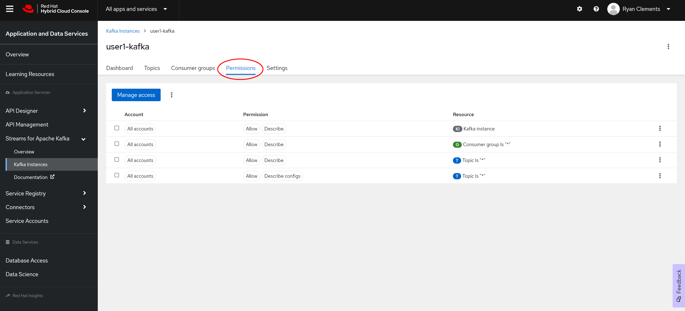
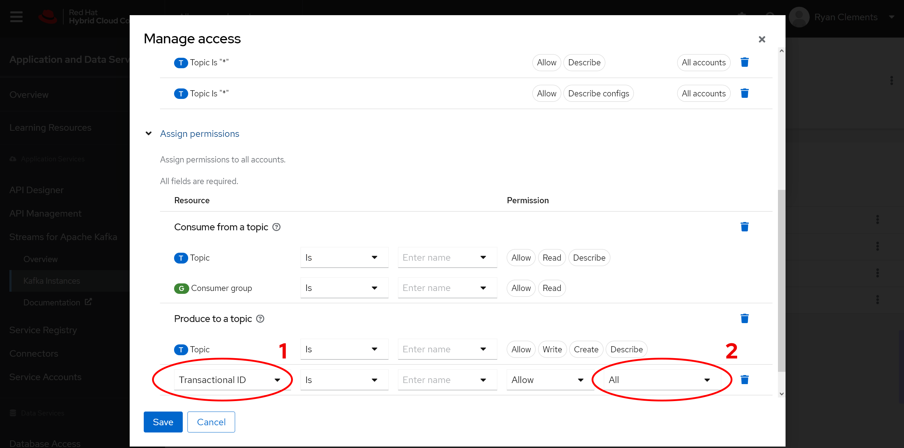

// Attributes
:walkthrough: Provision a Managed Kafka cluster
:title: Lab 1 - {walkthrough}
:user-password: openshift
:standard-fail-text: Verify that you followed all the steps. If you continue to have issues, contact a workshop assistant.
:namespace: {user-username}
:product-name: Streams for Apache Kafka
:codeready-url: https://devspaces.{openshift-app-host}/
:cloud-console: https://console.redhat.com/
:experimental:
:icons: font
:source-highliter: highlight.js

= {title}

This lab guides you through the process of obtaining a Kafka cluster that is managed by Red Hat using Red Hat OpenShift Streams for Apache Kafka.

*Overview*

This series of labs will guide you through the deployment of a hybrid-cloud architecture. A key element of this architecture is event streaming based upon Apache Kafka.

Managing Kafka is a specialized task. Red Hat OpenShift Streams for Apache Kafka provides Kafka clusters that are managed by Red Hat in the cloud vendor and region of your choice. This allows you to focus on business objectives, while Red Hat OpenShift {product-name} takes care of your infrastructure.

[type=walkthroughResource]
.Red Hat Hybrid Cloud
****
* link:{cloud-console}[Console, window="_blank"]
****

:sectnums:

[time=5]
== Accessing OpenShift {product-name}
'''
. Log in to the Red Hat Hybrid Cloud Console at link:{cloud-console}[console.redhat.com, window="_blank"].
+
[NOTE]
====
If you do not have an existing account follow the *Register for a Red Hat account* link on the login page to create one. Otherwise use your Red Hat account to log into the system.
====
+
image::images/000-cloud-register.png[Register]
. Expand the *Find an app or service* dropdown at the top and select the *{product-name}* item.
+
image::images/001-app-services.png[Find app or service]
. Dismiss the feedback dialog by clicking on *Ask me later* or clicking the *X*.
+
image::images/002-dismiss-tour.png[Close Feedback]

{blank}

At this point you should be logged in and viewing the *OpenShift {product-name}* UI.

{blank}

image::images/00-kafka-streams-home.png[OpenShift {product-name} UI]

{blank}

Now that you have a cloud services account, you can start creating resources.

[time=10]
== Creating a Kafka Instance

. Click the *Create Kafka instance* button.
+
image::images/000-create-kafka-instance.png[Create Kafka Instance]

. Enter a name for your Kafka instance, e.g `{user-username}-kafka`.
. Select the appropiate region for your location.
. Use the default values for the other parameters.
. Click the *Create instance* button.
+
image::images/001-create-user-instance.png[Create User Instance]
. This will start your cluster deployment. You should be able to see the status *Creation pending*.
+
image::images/002-creation-in-progress.png[Creation Pending]
+
{blank}
+
[NOTE]
====
Creation can take between 5 to 15 minutes. 
====

The *Status* column in the UI will display a
green checkmark and *Ready* status one the instance has finished provisioning.

{blank}

image::images/01-kafka-ready.png[Kafka instance in Ready state]

{blank}

[type=verification]
Were you able to successfully create the Kafka cluster?
Next up, it is time to create an account for application to connect to your new Kafka cluster.

[type=verificationFail]
{standard-fail-text}

[time=5]
== Instance Connection Details And Permissions

Connecting to a {product-name} instance requires the *Bootstrap server URL* and
the *Client ID* and *Client Password* associated with a *Service Account*.

This section will show you how to obtain these values.

=== Obtain the Connection Details

. Click the kebab menu at the right side of the row of your Kafka instance and click *View details* to view the instance details panel.
+
image::images/000-view-details.png[View Details]
. Select the *Connection* tab. Click the clipboard button to copy the *Bootstrap server* URL from this screen. Then click on *Create service account*.
+
image::images/02-kafka-details.png[Kafka instance in Ready state]
. Enter `{user-username}-sa` in *Short description* for the Service Account. Click *Create*
+
image::images/001-create-serviceacount.png[Create service account]
. Copy the *Client ID* and *Client Secret* by clicking the clipboard button for each field to a secure location. After you are sure that you have the values secured, select the checkbox and click the *Close* button.
+
image::images/03-kafka-credentials.png[Kafka Service Account Details]
+
{blank}
+
[NOTE]
====
The service account *Client Secret* is only showed once in this dialog. If you didn't capture the value, you will need to regenerate the credentials for the service account.
====

=== Set Service Account Permissions

{product-name} is secure by default. Administrators must grant resource access to Service Accounts.

Follow these steps to provide your new Service Account with broad permissions:app-name: 

. Navigate to the *Kafka Instances* page.
. Click on the name of your Kafka instance to view the instance *Dashboard*.
. Select the *Permissions* tab. The permissions configured for this Kafka instance and Service Accounts are displayed.
+

. Click the *Manage access* button. A dialog is displayed.
. Select *All accounts* from the *Account* dropdown.
+
image::images/041-kafka-all-accounts.png[Kafka instance permissions]
. Click *Next*. A dialog containing *Review existing permissions* and *Assign permissions* sections is displayed.
. Click on the link *Review existing permissions* and *Assign permissions* links to open up the details for each.
+
If you review the permissions, you'll notice that there have been some permissions already assigned. However, those permissions do not allow read or write access access. Let's go ahead and add read/write access in the next steps.
+
. Click on the *down arrow \/* of the *Add Permission* button at the very bottom in the *Assign permissions* section and select "Consume from a topic".
+

+
. Repeat the process that you just completed in the previous step, but this time click on *Produce to a topic* instead.
+
This will add *write* access permissions to the *Topic*.
+

+
. Click directly on the *Add Permission* button this time, not on the down arrow. This will allow you to add a single permission.
+

+
. Select *Transactional ID* for the type, and select *All* for the operation.
+
At this point, you should have four (4) new permissions as shown in the screenshot below:
+

+
. Click on the *Enter name* input box for each permission and type an *asterix* * and click the **Create "*****"** option that appears.
+
Repeat this process for each the four (4) added permissions.
+
When completed, your permissions should look like the following:
+

. Click *Save*. The new permissions should be reflected on the *Permissions* page.
+

+
[NOTE]
====
The access rules assigned during this lab are very permissive. In production you should provide a specific Service Account with access to specific resources, and avoid using the *All accounts* and wildcards (`*`) as much as possible.
====

You are now ready to test the connectivity to your cluster.

[type=verification]
Were you able to successfully obtain the Connection Details?

[type=verificationFail]
{standard-fail-text}

[time=10]
== Verify Connectivity

[type=taskResource]
.Red Hat OpenShift Dev Spaces
****
* link:{codeready-url}[Console, window="_blank", , id="resources-codeready-url"]
****
[type=taskResource]
.Credentials
****
* *username:* `{user-username}`
* *password:* `{user-password}`
****

Now that you have a cluster an account created is time to test the connectivity to your cluster. 

You'll use the link:https://github.com/edenhill/kafkacat[kcat, window="_blank"] command line utility to verify connectivity to your managed Kafka instance.

{blank}

. Navigate back to the link:{codeready-url}[OpenShift Dev Spaces Workspace, window="_blank"] tab
. If you haven't done it, open the workspace named `dayinthelife-workspace`.
+

+
. If you don't have your terminal tab open:
.. Navigate to Menu > Terminal > New Terminal
+
Alternatively, you can use the hotkey `CTRL+SHIFT+`
+
It's the backtick, which looks like the reverse single-quote.
+

+
If it opened succesfully, you should have a split screen at the bottom with a linux prompt. The terminal window looks like the following screenshot:
+

+
Remember in the previous sections, you created a Kafka user and generated a *Client ID* and *Client secret*?

[NOTE]
Do you recall your commitment to having "copied the client ID and secret"? I trust that you followed through on your commitment because in the upcoming section, we will be requiring these values.

. Run the following commands to connect to your Kafka instance and list topic metadata:
+
[NOTE]
Don't forget to replace the `<replace-me>` part of the command with the values you previously wrote down.

.. **Export the Bootstrap server**
+
[source,bash,subs="attributes+"]
----
export BOOTSTRAP_SERVER=<replace-me>
----
.. **Export the Client ID**
+
[source,bash,subs="attributes+"]
----
export CLIENT_ID=<replace-me>
----
.. **Export the Client Secret**
+
[source,bash,subs="attributes+"]
----
export CLIENT_SECRET=<replace-me>
----
.. **Finally run the ``kcat`` command**
+
[source,bash,subs="attributes+"]
----
kcat -b $BOOTSTRAP_SERVER \
-X sasl.mechanisms=PLAIN \
-X security.protocol=SASL_SSL \
-X sasl.username=$CLIENT_ID \
-X sasl.password=$CLIENT_SECRET -L
----
. The command will print a list of brokers and topic metadata if you've passed valid parameters.
+
image::images/04-kafkacat-metadata.png[Kafkacat Metdata Listing]

{blank}

[type=verification]
Through the connection we created. Were you able to successfully view kafka cluster detail from another cloud using kafkacat?

[type=verificationFail]
{standard-fail-text}

Congratulations! You successfully created a new Kafka cluster to send and receive events. You're now ready to move onto the next lab!
