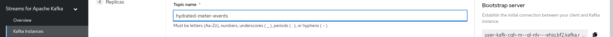

// Attributes
:walkthrough: Serverless Integration with Camel K
:title: Lab 2 - {walkthrough}
:user-password: openshift
:standard-fail-text: Verify that you followed all the steps. If you continue to have issues, contact a workshop assistant.
:namespace: {user-username}
:rhosak: Red Hat OpenShift Streams for Apache Kafka
:rhoas: Red Hat OpenShift Application Services
:product-name: {rhosak}
:meter-topic: hydrated-meter-events
:cloud-console: https://console.redhat.com

// URLs
:openshift-streams-url: https://console.redhat.com/beta/application-services/streams/kafkas
:next-lab-url: https://tutorial-web-app-instructions.{openshift-app-host}/tutorial/dayinthelife-serverless.git-labs-03-kafka-mirrormaker-camelk/
:codeready-url: https://devspaces.{openshift-app-host}/

[id='knative-serving-camel-k']
= {title}

In this lab, you will be part of the team at International Inc that will be helping your local town to enable "smart city" capabilities using serverless technologies.

*Overview*

Your town is starting its journey to become a *smart city*. Recently, the county updated Parking Meters in its most popular zones with IoT capabilities. These "smart" parking meters can be programmed to ping a REST API endpoint when they change status, e.g from _AVAILABLE_ to _OCCUPIED_.

Data generated by the smart Parking Meters needs to be made available to city engineers in real-time via web/mobile applications, but it also needs to be persisted and joined with reference data from a an existing RDBMS.

In this lab you'll create and deploy a REST API that will ingest Parking Meter updates. The REST API will write these updates to the existing PostgreSQL database, and your Managed Kafka cluster from {rhosak}.

Your REST API will be built using Quarkus and Camel  K, and served using
Knative. Knative will allow this API to scale up/down based on load.

image::images/00-arch.png[Overview, role="integr8ly-img-responsive"]

A quick reminder before you get started. Use the following credentials to login into the OpenShift and OpenShift Dev Spaces consoles:

* Your *username* is: `{user-username}`
* Your *password* is: `{user-password}`

[type=walkthroughResource]
.Red Hat OpenShift Dev Spaces
****
* link:{codeready-url}[Console, window="_blank", , id="resources-codeready-url"]
****
[type=walkthroughResource]
.Red Hat OpenShift Developer Console
****
* link:{openshift-host}/topology/ns/{namespace}?view=graph[Topology View, window="_blank"]
****
[type=walkthroughResource]
.Red Hat OpenShift Application Services
****
* link:{openshift-streams-url}[Streams for Apache Kafka, window="_blank"]
****

:sectnums:

[time=5]
== View the Project Topology and UI

Some services for this lab were provisioned ahead of time to provide a streamlined lab experience. View the services by following these instructions:

. Login to the link:{openshift-host}/topology/ns/{namespace}?view=graph[OpenShift Console, window="_blank"] to view the *{namespace}* project.
. The Topology view should look similar to this screenshot.
+
image:images/01-topology.png[Initial Project Topology]
. The services displayed are as follows:
    * A Postgres database containing reference data for Parking Meters. This database has the Debezium CDC extensions pre-configured to simplify this workshop.
    * A GraphQL API built using Node.js and link:https://graphback.dev[Graphback, window="_blank"]. This provides access to Meter and Junction data stored in Postgres.
    * An NGINX container that serves a web application built using React. This web application communicates with the GraphQL API.
. Click on the NGINX node in the Topology View and select the the *Resources* tab.
+
image:images/000-nginx-resources.png[NGINX Resources]
. Scroll all the way down and click the URL listed under *Routes*. It should look similar to the following: `https://sensor-management-ui-{namespace}.{openshift-app-host}`.
+
image:images/001-nginx-route.png[NGINX Route]
. The link should render a web application with a title *LA Department of Transport* similar to the one shown below.
+
image:images/02-ladot-home.png[DoT Home Page]
. Click the *Meters* link in the navigation bar at the top of the application. A list of meters should be displayed.
+
image:images/002-meter-view.png[DoT Meters]
+
{blank}
+
[NOTE]
====
The previous step verifies that the Node.js GraphQL API is communicating with the Postgres database.
====
. Enter `santa monica` into the search field and press Enter or click the blue *Search* button. Parking Meters from _Santa Monica Blvd_ are listed.
+
image:images/003-santamonica-meters.png[DoT Santa Monica Meters]
. Select the first item on the list. A details screen for that Parking Meter should be displayed.
+
image:images/03-meter-search.png[LA DoT Search Page]

{blank}

[type=verification]
Were you able to view the Meters list in the web application? If so, you are ready to start working on the next set of tasks.

[type=verificationFail]
{standard-fail-text}

[time=10]
== Prepare the Kafka Integration

=== Create a Kafka Topic

Before building the REST API, you'll need to create a Topic using the {rhosak} UI.

. Open the link:{openshift-streams-url}[OpenShift Streams Console, window="_blank"].
. Click name of the Kafka cluster you created in the previous lab,e.g `{user-username}-kafka`. This will display a cluster Dashboard.
. Select the *Topics* tab from the UI.
+

. Click the *Create Topic* button
.. Enter `{meter-topic}` for the topic name, and click *Next*.
+

+
.. Set the number of partitions to 3, and click *Next*.
+
image:images/kafka-create-topic-2.png[Enter topic partitions]
+
.. Leave the message retention settings at the default values, and click *Next*.
+
image:images/kafka-create-topic-3.png[Leave retention defaults]
+
.. The minimum in-sync replicas is hardcoded to 1.
+

+
. Click *Finish* to create the Topic.

=== Connect your Kafka Cluster and OpenShift Project

Your OpenShift environment has been pre-configured with the {rhoas} Operator. This Operator, along with the {rhoas} CLI simplifies the management of managed service credentials and access.

Embed your Managed Kafka connection details OpenShift Project:

. Obtain a token from link:{cloud-console}/openshift/token[console.redhat.com/openshift/token, window="_blank"] using the *Load Token* button.
+
The Operator will use this to communicate the {rhoas} APIs.
+
Ensure to **copy and paste** this token to a safe location for easy retrieval for a future step.
+
image:images/07-openshift-token.png[Red Hat Cloud Token]
. Navigate to your workspace in link:{codeready-url}[OpenShift Dev Spaces, window="_blank"].
. If you haven't done it, open the workspace named `dayinthelife-workspace`.
. If you don't have your terminal tab open:
.. Navigate to Menu > Terminal > New Terminal
+
[NOTE]
Alternatively, you can use the hotkey `CTRL + SHIFT + ``
It's the backtick, which looks like the reverse single-quote.
+
image::images/dayinthelife-workspace-terminal-1.png[Open Terminal window]
+
If it opened succesfully, you should have a split screen at the bottom with a linux prompt. The terminal window looks like the following screenshot:
+
image::images/dayinthelife-workspace-terminal-2.png[Terminal window]
+
. First, login into OpenShift using the OpenShift CLI:
+
[source,bash,subs="attributes+"]
----
oc login -u {user-username} -p {user-password} https://$KUBERNETES_SERVICE_HOST:$KUBERNETES_SERVICE_PORT --insecure-skip-tls-verify=true
----

. Next, login using {rhoas} CLI by using the token that you created in step one.
+
[source,bash,subs="attributes+"]
----
export TOKEN=<YOUR_TOKEN_GOES_HERE>
----
+
It will look like this:
+

+
{blank}
+
[source,bash,subs="attributes+"]
----
RHOAS_TELEMETRY=true rhoas login --token $TOKEN
----
+
It will look like this:
+

+
{blank}
+
[NOTE]
====
If prompted, select `Y` for the anonymous data if you wish to send anonymous data to help Red Hat understand the usage of its services. This **anonymous** information helps Red Hat build better products and services. However, the RHOAS_TELEMETRY=true variable that we set should skip this question. You may also set it to false if you wish.
====
+
{blank}
+
You will see a success message similar to this:
+
----
✔️  You are now logged in
----

. Set your Managed Kafka as the working context. This command will provide a prompt to choose your Kafka cluster:
+
[source,bash,subs="attributes+"]
----
rhoas kafka use
----
+

. Connect your Managed Kafka and OpenShift Project:
+
[source,bash,subs="attributes+"]
----
rhoas cluster connect --token $TOKEN --namespace {namespace}
----
+
{blank}
+
You will be prompted to select a service. Choose `kafka`.
+

+
{blank}
+
. Select `yes` when prompted if you would like to continue.
+

+
You should see a result similar to the following:
+
The command will take around one (1) minute to complete. Once it is 
complete, you will see a command such as:
+
✔️  Connection to service successful.
+
{blank}
+
At this point your OpenShift Project will have the required details for applications to connect to your Managed Kafka. These details include:

* A `KafkaConnection`` Custom Resource (CR)
* A `rh-cloud-services-service-account` Secret. This contains a SASL Client ID and Client Secret.
* A `rh-cloud-services-accesstoken` Secret. This contains the {rhoas} API token.

Verify these resources exist using the following commands:

. List the Secrets and verify the list contains *rh-cloud-services-service-account* and *rh-cloud-services-accesstoken*:
+
[source,bash,subs="attributes+"]
----
oc get secrets -n {namespace}
----
. Describe the *KafkaConnection*, and verify that the output contains references to the Secrets and Bootstrap Server:
+
[source,bash,subs="attributes+"]
----
oc describe kafkaconnection -n {namespace}
----

Your now ready to deploy applications that connect to your Managed Kafka cluster.

[time=15]
[id="Serving with API"]
== Knative Serving, Camel K, and REST API

After gaining familiarity with the **OpenShift topology** and the available services, and setting up a **Kafka topic** for data ingestion, the next step is to construct and launch the **REST API**. The REST API is developed utilizing **Camel K** and **Quarkus**.

In this next section, we've made **every effort** to present the information in simple terms for **non-developers to comprehend**. _Don't tell the geeks we said this_, but the truth is, #technology isn't complicated#, but the terminology and language used by some experts can make it seem that way.

For example: "Serverless containers using Knaive and Camel-K and Quarkus in a hybrid-cloud federated architecture."

_Come on now_, that's **not helping anyone** except for the people who already know what those things are.

They may do this to sound intelligent or knowledgeable, but it only creates confusion and difficulty for everyone else. The information below is is every day English. If you want more clarification on any of the technologies presented, please ask your presenters and they'll be glad to help.

[NOTE]

Even if you choose not to read everything about Camel K, Quarkus, and Knative below, it won't hinder your ability to complete the lab. However, we've included information on these technologies to enhance your understanding and make you a more knowledgeable person in the field of technology. For that reason, we encourage you to take a few moments and learn about these fascinating technologies. **If you do not want to read it all and only want to complete the workshop, then scroll down to section 3.3.**

===== #Camel K#

**TL;DR** ``Camel K`` is a tool that help developers integrate software applications more easily and efficiently.

``Camel K`` is a program that helps developers make different parts of an application talk to each other. It does this by using a language called **Java** to create an **API** (**A**pplication **P**rogramming **I**nterface). Camel is built on top of the ``Apache Camel project``.

**So what't the K?**

The **K** stands for **Kubernetes**! Camel-"**K**" provides a Kubernetes-native integration platform that is used to integrate services in many environments! Since we're using ``Knaive`` in this project, which is a "serverless" container technology (more on this later,) we need to use ``Camel K`` instead of ``Apache Camel``. _Make sense so far?_

**Give me an example!**

Let's say you have a database that stores important information, such as our "**Meter Real-Time Sensor Data**" application we created to support our pretend scenario at the beginning of this workshop.

That application needs to access a database to **read** and **store** data. ``Camel K`` can help the application talk to the database by easily creating a custom **API**. This means that the application can interact with the **API** instead of directly connecting to the database, making it easier to access the information it needs without a lot of complexity.

**But why??? It sounds like an extra step.**

_You raise a valid point._ Using ``Camel K`` does add an extra step and can make our architecture more complex instead of directly connecting to the database. However, ``Camel K`` offers the **advantage** of being able to add more "**routes**" to our architecture, which you'll see later in this lab when you look at the Java code.

Here's our reference architecture with some steps drawn on it. We'll discuss these steps below.

Here is what is happening in the reference architecture below:

. Our "**Meter Real-time Sensor Data**" app sends data to ``Camel K``, such as the ``meter ID`` and the ``meter status``
+
"_Hi I'm meter ``ID 9001``, and I'm ``online``!_"
+
. ``Camel-K`` then **writes** the ``meter ID`` and ``meter status`` to the **SQL database**
. ``Camel-K`` then **reads** from the **SQL database** to gather a bit more information about the meter that just reported its status, such as longitude and latitude of the meter.
. ``Camel-K`` sends the ``meter ID``, ``meter status``, ``meter longitude`` and ``meter latitude`` to **Kafka**
+
By sending it to **Kafka**, another app can read that data on the **Kafka stream**. But, Kafka doesn't store data permanently. So, that's why we also stored it in the **SQL database** for long-term storage.
+
image:images/camel-k-ref-arch.png[Camel-K reference architecture]
+
Do you see why ``Camel K`` makes sense here? It's been programmed to do a lot of work with minimum lines of code and effort from a developer.

With ``Camel-K``, we can easily ingest the data from the application and send it to **multiple routes** using just a few lines of Java code. We can also add or remove routes later on with just a few more lines of Java code.

It's okay if you don't undestand SQL database queries or Java code. The code below can look odd to people who don't develop code. The point is, it is trivial to add and remove routes once you have a few copy/paste code snippets stored away!

In the past, developers had to write many lines of code and wrestle with integrations with each place they wanted to send their code. Camel K is a modern way to do more in less time and less hassle.

There, now you know all you need to know about ``Camel K``. _It's literally the swiss army knife of integrations._

===== #Quarkus#

``Quarkus`` is a tool that helps developers build Java applications for **cloud-native** architectures faster and with less code.

Remember what we said about buzzwords? Cloud-native is just a buzzword, or marketing technical jargon for "**containers**." We wanted to add that in there because you'll be hearding the buzzword **cloud-native** a lot in your _application modernization_ journey. _Ugh_, there's **another** buzzword - I'm sorry!

**Application modernization** is another way to simply say '_Convert the old-style VMs to modern container architecture._'

``Quarkus`` it makes it easier for developers to write software that is efficient and runs smoothly on containers. That is, Java applications, because Java programming is very popular in corporate environments.

**Please explain what you mean.**

Okay! Java programs have been typically have had a **huge memory footprint** for even printing something as simple the _rites-of-passage_ program that most budding programmers create: The '**Hello World!**' program. Java programs are also **very slow**. These are two attributes that don't mesh well with the point of containers - which are supposed to have a **low CPU and memory footprint** and **spin up and down quickly**.

What is the solution? ``Quarkus`` is the solution because it has been specifically created to solve these problems with Java programs. Quakus allows Java programs to run leaner with less of a CPU and memory footprint and spin up and down quicker than methods in the past.

``Quarkus`` can help developers build many types of applications, from simple websites to complex programs used by businesses and organizations.

Lastly, ``Quarkus`` can also integrate programs and routes like ``Camel-K``. There is a lot of overlap between the two technologies right now.

===== #Quarkus vs Camel-K#

A deep-dive comparison between the two technologies is beyond the scope of this workshop.

However, in summary:

- ``Quarkus`` is focused on **optimizing Java applications for cloud-native architectures**
- ``Camel-K`` is focused on **simplifying the process of building and deploying event-driven and message-based applications**.

Both frameworks have their own strengths and use cases, and the choice between them will depend on the specific requirements of your application.

=== Define and Build the API
GitHub updated sources (ignore these links unless you run into issue later)
https://raw.githubusercontent.com/rclements-redhat/dayinthelife-serverless/kamel_1.8.2/projects/lab-01/MeterConsumer.java[MeterConsumer.java]
https://raw.githubusercontent.com/rclements-redhat/dayinthelife-serverless/kamel_1.8.2/projects/lab-01/meters.properties[meter.properties]

. Navigate to your workspace in link:{codeready-url}[OpenShift Dev Spaces, window="_blank"].
. Expand the *projects/lab-01* folder.
. Open the *openapi-spec.yaml* file.

{blank}

This file defines the API you'll deploy. Notice that the API:

* Exposes a `POST /meter/status` endpoint.
* The POST request `content-type` must be `application/json`.
* A *meterstatus* schema is defined as the format for the POST body.
* The response type on success is defined as `200 OK`.

{blank}

Camel K will use expose this OpenAPI Spec for consumers to build compliant API clients.

To build the REST API:

. Navigate to your workspace in link:{codeready-url}[OpenShift Dev Spaces, window="_blank"].
. Expand the *projects/lab-01* folder.
. Open the *MeterConsumer.java* file.

{blank}

The *MeterConsumer.java* file defines a link:https://camel.apache.org/manual/latest/java-dsl.html[Camel Route using the Java DSL, window="_blank"].

The first nineteen lines of this file contains `Camel-K` directives. These directives define options that are used by `Camel-K`` when it builds and deploys the Camel Route. For example, it references the *openapi-spec.yaml* file to define the REST API endpoint, and the *rh-cloud-services-service-account* Secret to connect to your Managed Kafka cluster.

. Open the *meters.properties* file and replace the *camel.component.kafka.brokers* value with your Managed Kafka bootstrap server URL. 

. The Kafka bootstrap server URL can be obtained via the UI, or CLI command:
+
[source,bash,role="copypaste",subs="attributes+"]
----
rhoas kafka describe
----

. Build and deploy the REST API as a serverless function:
+
[source,bash,role="copypaste",subs="attributes+"]
----
cd projects/lab-01/
----
+
[source,bash,role="copypaste",subs="attributes+"]
----
kamel run MeterConsumer.java --namespace {namespace}
----
+

-> **IMPORTANT** <-
+
**The application will take a minute or two to properly provision the first time, -> so be patient. <-**
+
Keep an eye out for the large blue square featuring the red OpenShift emblem in the center. Once you spot it, you'll know that the provisioning process is complete. However, your wait isn't quite over yet.
+
image:images/08-camelk-serverless-up.png[Camel K serverless APP]

. Wait for another minute, the serverless application will scale down to zero. In developer view console, the blue circle will disaapear and eventually disappear. 
+
image:images/08-camelk-serverless-down.png[Camel K serverless APP]

=== Test the REST API
. Return to the link:{openshift-host}/topology/ns/{namespace}?view=graph[OpenShift Topology View, window="_blank"] and wait for the *meter-consumer* Pod to start.
+
image:images/09-camelk-pod.png[Camel K Pod]
. Click the Camel K Pod and copy the URL listed under *Routes*.
. In the OpenShift Dev Spaces terminal, send a HTTP POST request to make sure everything works correctly:
+
[source,bash,role="copypaste",subs="attributes+"]
----
export TIMESTAMP=`date +%s`

curl -X POST \
http://meter-consumer-{namespace}.{openshift-app-host}/meter/status \
-H 'content-type: application/json' \
-d '
     {
        "key": "F6PeB2XQRYG-8EN5yFcrP",
        "value": {"meterId":"F6PeB2XQRYG-8EN5yFcrP","timestamp":'$TIMESTAMP',"status":"unknown"}
      }
'
----
+
**^^ Be careful not to miss the last single quote `'` on the last line in your copy/paste.**
+
**^^ It's hiding from you and will cause the above step not to work if you miss it!**

. Fetch the inserted result, from the database:
+
[source,bash,role="copypaste"]
----
oc exec $(oc get pods -o custom-columns=POD:.metadata.name --no-headers -l app=iot-psql) -- bash -c 'psql -d $POSTGRES_DB -U $POSTGRES_USER -c "select * from meter_update;"'
----
+
[NOTE]

If you get an error after running the above command, ensure you are switched into the correct namespace. You can switch into the correct namespace by typing ``oc project --user {user-username}``
+
image:images/10-db-result.png[PostgreSQL Query Output]
. Return to the link:{openshift-host}/topology/ns/{namespace}?view=graph[OpenShift Topology View, window="_blank"] and wait for the *meter-consumer* Pod to scale down to zero. You'll know this happened when the blue circle turns white.

. In the OpenShift Dev Spaces terminal, send another HTTP POST request, and see the Pod scales back up to handle it:
+
[source,bash,role="copypaste",subs="attributes+"]
----
export TIMESTAMP=`date +%s`

curl -X POST \
http://meter-consumer-{namespace}.{openshift-app-host}/meter/status \
-H 'content-type: application/json' \
-d '
     {
        "key": "F6PeB2XQRYG-8EN5yFcrP",
        "value": {"meterId":"F6PeB2XQRYG-8EN5yFcrP","timestamp":'$TIMESTAMP',"status":"unknown"}
      }
'
----

[type=verification]
Did it scale up and down?

[type=verificationFail]
{standard-fail-text}

[time=1]
[id="summary"]
== Summary

In this lab you successfully create and deploy a REST API that will ingest Parking Meter updates with simple Camel serverless integrations.
You can now proceed to link:{next-lab-url}[Lab 3].
